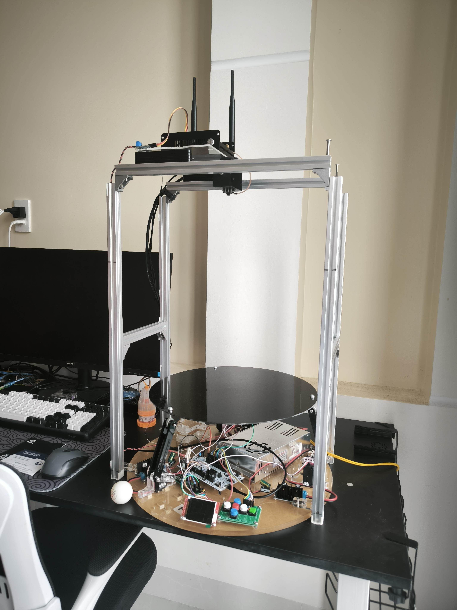
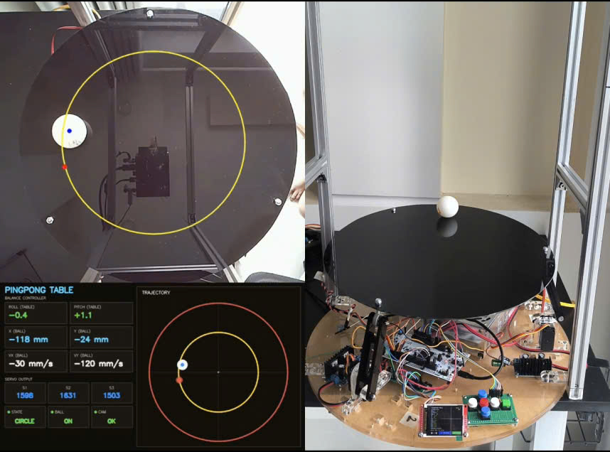
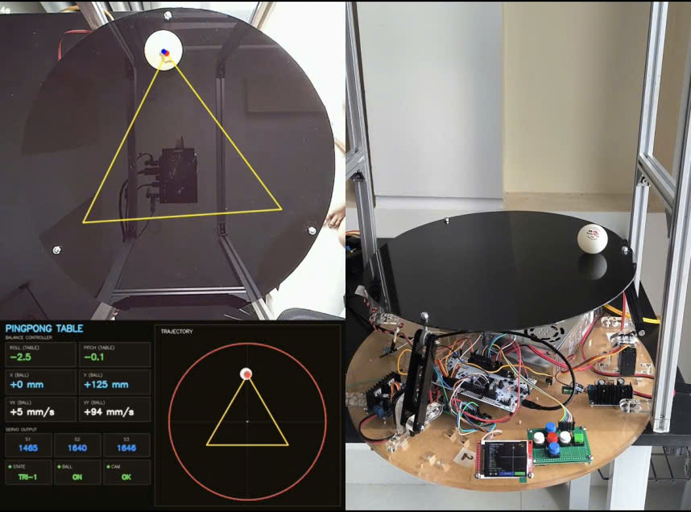
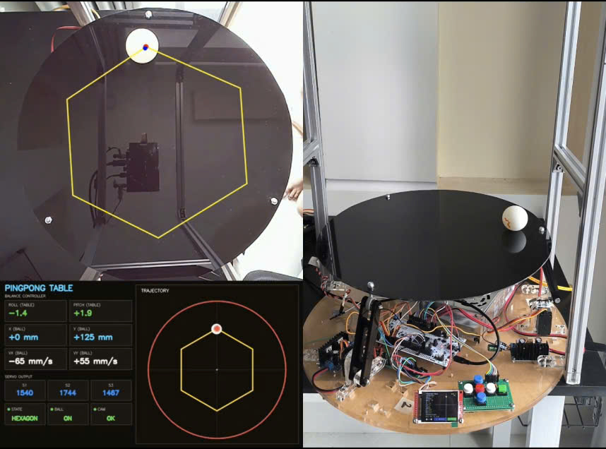
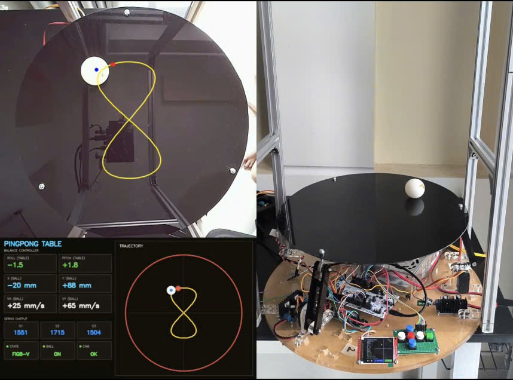
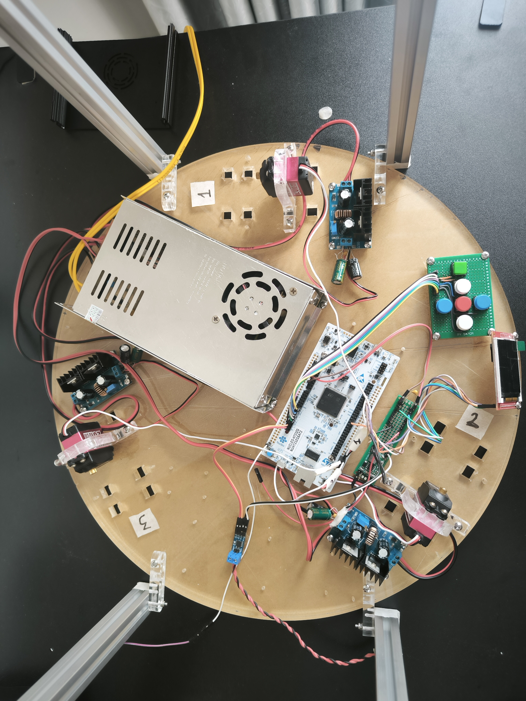

# Vision-Based Ball Balancing Table

### STM32H723 + Jetson Orin Nano | Computer Vision | Real-Time Control | Robotics

A vision-based three-servo ball-balancing system integrating computer vision, real-time embedded control, CAN communication, calibrated inverse kinematics, trajectory generation, and layered fault handling.

The core design principle is:

> **Jetson handles perception and high-level computation. STM32 owns the final real-time actuator path.**

---

## Demo



The system closes the loop from camera observation to physical actuation:

```text
Camera
  ↓
Ball Detection
  ↓
Ball State
  ↓
Control
  ↓
CAN
  ↓
STM32 / FreeRTOS
  ↓
Trajectory
  ↓
Inverse Kinematics
  ↓
Servo Actuation
  ↓
Physical Balancing
```

---

## System Architecture

```text
                         CAMERA
                            │
                            ▼
                 ┌─────────────────────┐
                 │   JETSON ORIN NANO  │
                 │                     │
                 │ Camera Capture      │
                 │ Ball Detection      │
                 │ Ball State          │
                 │ PID / Control       │
                 │ Linux Diagnostics   │
                 └──────────┬──────────┘
                            │
                           CAN
                            │
                            ▼
                 ┌─────────────────────┐
                 │      STM32H723      │
                 │                     │
                 │ FreeRTOS            │
                 │ IMU / SPI DMA       │
                 │ State Machine       │
                 │ Trajectory          │
                 │ Inverse Kinematics  │
                 │ Servo Control       │
                 │ Calibration         │
                 │ Failsafe / IWDG     │
                 └──────────┬──────────┘
                            │
                     ┌──────┼──────┐
                     ▼      ▼      ▼
                   Servo  Servo  Servo
                     1      2      3
                            │
                            ▼
                    BALANCING TABLE
                            │
                            ● Ball
```

### Processor responsibility

**Jetson — Perception & High-Level Control**

```text
Camera
  ↓
Capture
  ↓
Ball Detection
  ↓
Ball State
  ↓
Control
  ↓
CAN
```

**STM32 — Real-Time Control & Actuation**

```text
CAN
 ↓
Target Validation
 ↓
Trajectory
 ↓
Inverse Kinematics
 ↓
Servo Constraints
 ↓
PWM
```

This keeps Linux scheduling out of the final physical actuator path.

---

## Engineering Highlights

### 1. Distributed real-time control

The feedback loop crosses two processors:

```text
Jetson / Linux
      ↕
     CAN
      ↕
STM32 / FreeRTOS
```

The design therefore accounts for communication loss, stale data, asynchronous tasks, and processor failures.

### 2. Cortex-M7 Cache + DMA

The STM32H723 uses a Cortex-M7 architecture with data cache. DMA-based SPI transfers therefore require explicit cache-coherency handling.

The IMU acquisition path is:

```text
IMU Data Ready
      ↓
    EXTI
      ↓
  SPI2 DMA
      ↓
 DMA Callback
      ↓
FreeRTOS Notification
      ↓
 IMU Fusion
```

### 3. Calibrated inverse kinematics

The mechanical mechanism is not treated as an ideal linear system.

The runtime model uses:

```text
[R, P, R², P², R·P, 1]
          ↓
   IK coefficients
          ↓
      S1 / S2 / S3
          ↓
   Servo constraints
          ↓
         PWM
```

Calibration data includes:

- Servo neutral positions
- Servo limits
- Servo deadband
- Roll/pitch offsets
- Second-order IK coefficients
- Version information
- CRC32 validation

Calibration is stored in STM32 internal Flash and validated before use.

### 4. Trajectory-controlled actuation

Target changes are passed through a trajectory layer rather than directly mapped to instantaneous servo commands.

```text
Target
  ↓
Trajectory Planner
  ↓
Velocity / Acceleration Limits
  ↓
Inverse Kinematics
  ↓
Servo Actuation
  ↓
Hard PWM Limits
```

The trajectory layer also supports controlled return-to-neutral behavior during fault handling.

---

## Layered Fault Handling

Safety is implemented across multiple layers:

```text
CAN Heartbeat
     +
Data Freshness
     +
Ball Validity
     +
FDCAN Recovery
     +
Task Supervision
     +
Trajectory Fallback
     +
Servo Hard Limits
     +
IWDG
```

### Application-level failure

```text
Stale Jetson Data
      ↓
Invalid Target
      ↓
Neutral Target
      ↓
Controlled Trajectory
      ↓
Bounded Servo Motion
```

### Critical firmware failure

```text
Critical Task Stops
      ↓
Watchdog Condition
      ↓
IWDG Timeout
      ↓
MCU Reset
```

The architecture distinguishes recoverable application faults from critical firmware execution failures.

---

## FreeRTOS Architecture

The STM32 firmware separates responsibilities into dedicated execution paths:

```text
Sensor / IMU
CAN RX
CAN TX
Control
Actuator
UI / Display
Logger
Safety
Watchdog
State Machine
```

This avoids a large super-loop and makes task ownership, synchronization, timing, and fault handling easier to reason about.

---

## Jetson Software Architecture

The Jetson side separates perception, control, communication, and diagnostics.

```text
Camera
  ↓
Capture
  ↓
Ball Detection
  ↓
Ball State
  ↓
Control Loop
  ↓
CAN TX
  ↓
STM32
```

Main software components include:

```text
camera_pipeline
ball_detector
pid_controller
can_transport
system_state

task_camera_capture
task_ball_detect
task_control_loop
task_can_rx
task_can_tx
task_video_record
task_watchdog
```

Video recording and disk I/O are kept outside the core control path.

---

## CAN Communication

CAN provides the processor boundary:

```text
Jetson Application State
          ↓
     CAN Protocol
          ↓
       SocketCAN
          ↓
        CAN Bus
          ↓
      STM32 FDCAN
          ↓
 STM32 Application State
```

The protocol definition is kept separate from Linux-specific transport handling, allowing the control layer to remain independent from SocketCAN implementation details.

---

## Trajectory Demonstrations

The trajectory system has been exercised with multiple reference paths:

- Circular
- Triangle
- Hexagon
- Figure-8

### Circular trajectory



### Triangle trajectory



### Hexagon trajectory



### Figure-8 trajectory



The runtime visualization combines the reference trajectory, detected ball position, platform state, roll/pitch values, and servo outputs.

---

## Hardware



### Main components

| Component | Role |
|---|---|
| STM32H723 | Real-time embedded controller |
| Jetson Orin Nano | Vision and high-level control |
| MPU6500 | Platform motion feedback |
| 3 × RC Servos | Table actuation |
| CAN | Jetson ↔ STM32 communication |
| Camera | Ball observation |
| TFT Display | Embedded UI |

---

## Technology Stack

### Embedded

- STM32H723 / ARM Cortex-M7
- FreeRTOS
- STM32 HAL
- SPI / DMA
- FDCAN
- PWM
- Internal Flash
- IWDG
- TFT display

### Linux / Robotics

- NVIDIA Jetson Orin Nano
- Linux
- C++
- Computer vision
- PID control
- SocketCAN

### Engineering

- Real-time task design
- Sensor acquisition and fusion
- Calibration
- Polynomial inverse kinematics
- Trajectory generation
- Fault handling
- Persistent configuration
- Hardware/software integration
- Experimental validation

---

## Documentation

Detailed engineering decisions are documented separately:

| Document | Focus |
|---|---|
| [`01-architecture.md`](docs/01-architecture.md) | System architecture |
| [`02-stm32h723-cache-memory.md`](docs/02-stm32h723-cache-memory.md) | Cortex-M7 cache and DMA |
| [`03-freertos-task-design.md`](docs/03-freertos-task-design.md) | FreeRTOS task architecture |
| [`04-can-protocol.md`](docs/04-can-protocol.md) | CAN protocol and communication |
| [`05-imu-mpu6500-spi-dma.md`](docs/05-imu-mpu6500-spi-dma.md) | IMU, SPI/DMA and estimation |
| [`06-tft-ui-design.md`](docs/06-tft-ui-design.md) | Embedded TFT UI |
| [`07-servo-trajectory-safety.md`](docs/07-servo-trajectory-safety.md) | Servo and trajectory control |
| [`08-failsafe-design.md`](docs/08-failsafe-design.md) | Fault detection and recovery |
| [`09-ik-calibration.md`](docs/09-ik-calibration.md) | IK calibration |
| [`10-jetson-vision-control.md`](docs/10-jetson-vision-control.md) | Jetson vision/control |

The README provides the system-level view. The documents above contain implementation details and engineering rationale.

---

## Project Scope

The current prototype integrates:

```text
Mechanical System
       +
Camera
       +
Computer Vision
       +
State Estimation
       +
Real-Time Firmware
       +
Control
       +
CAN
       +
Trajectory Generation
       +
Inverse Kinematics
       +
Servo Actuation
       +
Fault Handling
```

The project focuses on the engineering problems that appear when software interacts with physical hardware:

- Real-time execution
- DMA and cache coherency
- Sensor validity and freshness
- Communication reliability
- Mechanical calibration
- Nonlinear actuator mapping
- Trajectory constraints
- Fault containment
- Safe actuator behavior

---

## Engineering Principle

> **Use the Jetson for computational flexibility and the STM32 for deterministic low-level authority.**

The goal is not to demonstrate a single algorithm in isolation, but to integrate perception, control, communication, real-time firmware, calibration, actuation, and fault handling into one physical robotic system.

---

## Repository Structure

```text
ball-balancing-table/
│
├── firmware-stm32h723/
│   └── STM32H723 firmware
│
├── jetson-vision-control/
│   └── Jetson vision and control
│
├── docs/
│   ├── 01-architecture.md
│   ├── 02-stm32h723-cache-memory.md
│   ├── 03-freertos-task-design.md
│   ├── 04-can-protocol.md
│   ├── 05-imu-mpu6500-spi-dma.md
│   ├── 06-tft-ui-design.md
│   ├── 07-servo-trajectory-safety.md
│   ├── 08-failsafe-design.md
│   ├── 09-ik-calibration.md
│   └── 10-jetson-vision-control.md
│
└── README.md
```

---

## Status

The system is an actively developed engineering prototype.

Performance metrics such as tracking error, control-loop timing, latency, and recovery time will be reported separately when supported by repeatable measurements.

**No performance figures are claimed here without experimental evidence.**