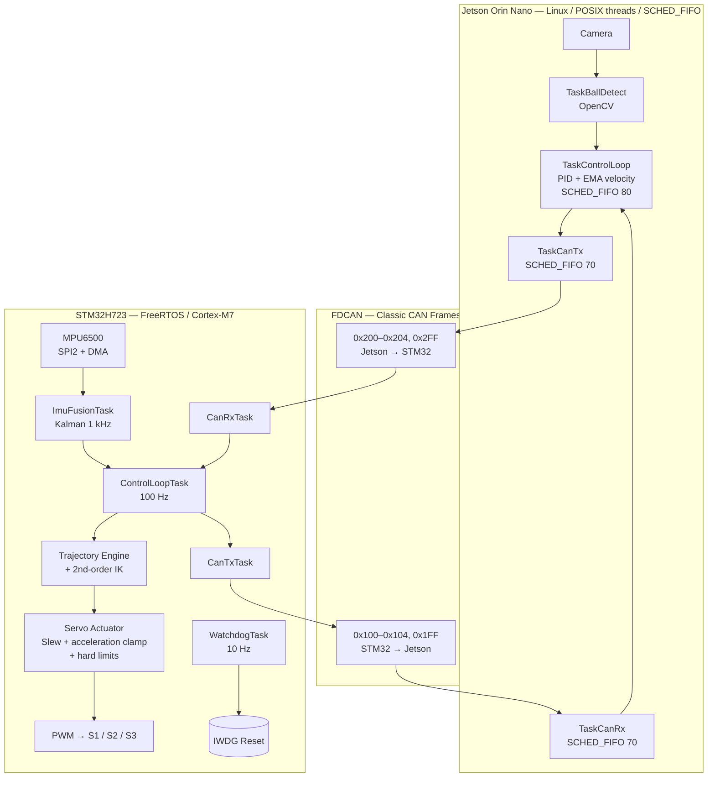

# 01 — System Architecture — Ball Balancing Table

> This document is the architectural entry point for the Ball Balancing Table firmware and control stack. It provides the system-level design rationale and points to the deeper technical documents for implementation details.

---

## 1. System Overview

The Ball Balancing Table is a three-servo platform that balances a ping-pong ball using camera-based position feedback and closed-loop control.

The system is intentionally divided between two processors with different real-time and computational characteristics:

- **NVIDIA Jetson Orin Nano** — handles computationally intensive, non-hard-real-time workloads:
  - camera processing and ball detection with OpenCV;
  - ball velocity estimation;
  - PID control for ball-position regulation;
  - high-level control decisions.

- **STM32H723** — handles deterministic, hardware-facing real-time workloads:
  - IMU acquisition and sensor fusion;
  - trajectory generation;
  - inverse kinematics;
  - servo command generation;
  - PWM output;
  - watchdog and hardware safety mechanisms.

The architectural rule is:

> **Work that directly affects physical actuation and requires deterministic timing belongs on the STM32. Work that is computationally intensive but can tolerate tens of milliseconds of latency belongs on the Jetson.**

The two processors communicate through a single FDCAN interface.

---

## 2. System Architecture



Detailed subsystem documentation:

- `02-stm32h723-cache-memory.md` — memory architecture, DMA, cache coherency, clocking, and MPU.
- `03-freertos-design.md` — task architecture and priority rationale.
- `04-can-protocol.md` — CAN identifiers and payload encoding.
- `07-servo-trajectory-safety.md` — trajectory generation, inverse kinematics, and actuator safety.

---

## 3. Why the STM32H723 Is Used for Real-Time Control

The STM32H723 is the hardware-facing controller because it provides deterministic access to:

- IMU;
- servo PWM;
- safety limits;
- watchdog;
- FDCAN;
- real-time scheduling through FreeRTOS.

The Jetson is significantly more capable for vision and high-level numerical processing, but Linux scheduling and camera processing are not appropriate as the final safety boundary for physical actuation.

The design therefore keeps the final actuator path on the MCU:

```text
Jetson
  │
  │ desired attitude / height
  ▼
STM32
  │
  ├── trajectory generation
  ├── inverse kinematics
  ├── actuator limiting
  └── PWM
       │
       ▼
    Servo S1/S2/S3
```

This means a delay or failure in the Jetson cannot directly bypass the STM32 actuator safety layer.

---

## 4. STM32H723 Memory and Cache Considerations

The H723 differs substantially from STM32F1/F4-class devices because the Cortex-M7 introduces:

- I-Cache;
- D-Cache;
- multiple memory domains;
- ITCM/DTCM;
- AXI/AHB SRAM;
- more complex peripheral clocking.

The project encountered and resolved two representative H7/DMA issues:

1. DMA buffers placed in a memory domain inaccessible to the selected DMA controller.
2. CPU/DMA cache coherency problems.

The working firmware uses:

```c
SCB_CleanDCache_by_Addr()
SCB_InvalidateDCache_by_Addr()
```

according to data direction.

The board is configured to run at **400 MHz**, rather than the device maximum frequency, with runtime verification of the relevant clock values.

The detailed analysis is documented in:

`02-stm32h723-cache-memory.md`

---

## 5. FreeRTOS Architecture

The STM32 firmware uses CMSIS-RTOS2 / FreeRTOS.

The main scheduling principle is to assign priority according to the consequence of missing a deadline rather than simply according to how frequently a task runs.

The critical path is:

```text
IMU / CAN input
      │
      ▼
ControlLoopTask @ 100 Hz
      │
      ▼
Trajectory Engine
      │
      ▼
Servo Actuator
      │
      ▼
PWM
```

`ControlLoopTask` has the highest application priority because it is the task that ultimately produces physical servo commands.

The display subsystem runs at a lower priority because delayed UI rendering does not affect control stability.

Shared high-rate state is designed around lock-free single-writer/multi-reader access where appropriate, while multi-writer configuration such as setpoints uses mutex protection.

The watchdog requires the critical tasks to report that they are alive within the same supervision window before refreshing the IWDG.

The detailed task architecture is documented in:

`03-freertos-design.md`

---

## 6. FDCAN Communication

The two processors use the FDCAN peripheral in **Classic CAN mode**.

The payloads fit within the standard 8-byte CAN data field, so CAN-FD is not required for the current protocol.

The project uses a shared CAN ID definition on both sides to prevent protocol drift.

Representative messages include:

```text
STM32 → Jetson
0x100  ATTITUDE
0x102  SERVO_POS
0x103  ROBOT_STATE
0x1FF  HEARTBEAT

Jetson → STM32
0x200  BALL_POS
0x201  BALL_VEL
0x202  BALL_STATE
0x204  ATTITUDE_DESIRED
0x2FF  HEARTBEAT
```

Angles and velocities are encoded as scaled integers rather than IEEE floating-point values to keep the payload compact and deterministic.

The communication layer uses two independent liveness mechanisms:

1. Explicit heartbeat frames.
2. Data-implied liveness derived from normal data traffic.

This prevents a system from being considered alive merely because a heartbeat frame is still being received while the actual application data path has stopped.

Detailed protocol definitions are documented in:

`04-can-protocol.md`

---

## 7. Servo Trajectory and Safety Architecture

The actuator path is deliberately divided into independent layers:

```text
Jetson
Roll_d / Pitch_d / Height_d
          │
          ▼
Trajectory Engine
          │
          ▼
Inverse Kinematics
          │
          ▼
Servo Actuator
          │
          ▼
PWM
```

The Trajectory Engine operates in the platform-angle domain and performs acceleration-continuous replanning.

Instead of assuming every new target starts from zero velocity, it uses the current trajectory state:

```text
(x0, v0, a0)
```

This is important because the Jetson continuously updates the desired target rather than sending isolated point-to-point commands.

For a sudden direction change, the trajectory generator inserts an explicit braking segment before reversing direction.

The Servo Actuator remains an independent final safety boundary in PWM space:

- slew-rate limiting;
- acceleration limiting;
- calibrated hard limits.

Therefore, even if an upper-level trajectory calculation is incorrect, the final PWM command remains constrained.

The detailed implementation is documented in:

`07-servo-trajectory-safety.md`

---

## 8. Failsafe Layers

The system uses multiple independent safety mechanisms:

| Failure mode | Mechanism | Threshold / behavior |
|---|---|---|
| STM32 ↔ Jetson communication loss | Explicit heartbeat | 200 ms |
| Camera / Jetson data loss | Data-implied liveness | 500 ms |
| FDCAN bus-off | Stop/Start recovery | Periodic polling |
| STM32 task stall | WatchdogTask + IWDG | 100 ms supervision window |
| Servo command exceeds physical range | Final actuator clamp | Calibration limits |
| Sudden target reversal | Explicit trajectory braking | Trajectory-dependent |

The safety architecture intentionally avoids relying on a single software layer.

---

## 9. Repository Structure

```text
firmware-stm32h723/        ← STM32H723 / STM32CubeIDE / FreeRTOS
jetson-vision-control/     ← C++ / POSIX threads / OpenCV / SocketCAN
docs/                      ← System and subsystem documentation
```

---

## 10. Architectural Design Principles

The architecture follows several principles:

### Separation of computational and real-time workloads

Vision and high-level control run on the Jetson; deterministic actuation runs on the STM32.

### Hardware-facing safety boundary

The STM32 remains the final authority over servo commands.

### Layered control

Trajectory generation, inverse kinematics, and actuator limiting are independent stages.

### Explicit communication contract

Both processors share one CAN ID definition and a documented payload format.

### Failure containment

Loss of camera, CAN, a critical task, or an invalid actuator command is handled by an independent safety layer.

### Real-time priority based on consequence

Task priority reflects the effect of a missed deadline on the physical system, not simply the amount of CPU work performed.

---

## 11. Engineering Summary

The system is structured so that the computationally intensive Jetson side can evolve independently from the deterministic STM32 actuator path.

The STM32 provides the final real-time boundary for:

```text
Sensor acquisition
      ↓
State estimation
      ↓
Control
      ↓
Trajectory generation
      ↓
Inverse kinematics
      ↓
Actuator safety
      ↓
PWM
```

The architecture therefore separates **high-level computation, deterministic control, communication, and hardware safety** while keeping the physical actuator path under MCU control.
