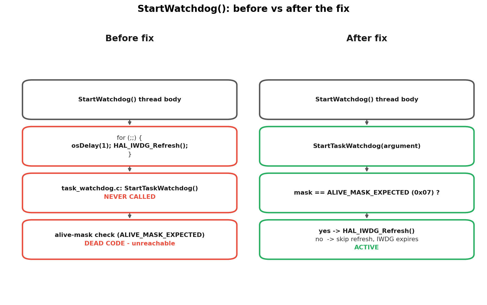
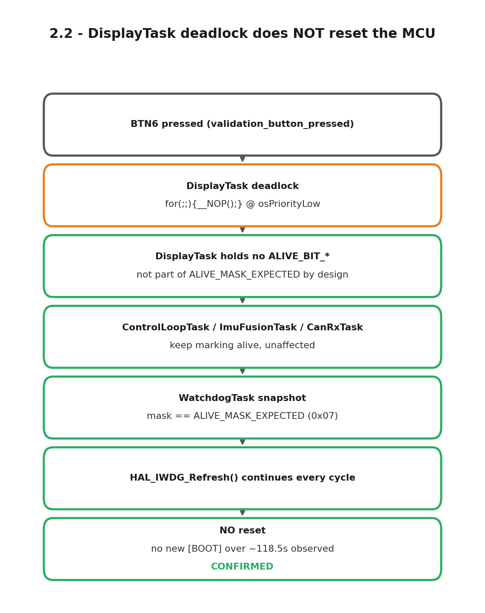

# Section 2 — Watchdog & fault-injection correctness
### STM32H723 — validation plan (completed)

> **Code + temporary build-flag tests + physical reset button only.** No ball
> on the table needed. STM32 firmware, developed on a separate workstation —
> git-synced before starting.

STM32H723 independent watchdog (IWDG): does it reset the MCU when a
safety-critical task deadlocks, does it correctly *not* reset when a
non-critical task deadlocks, and does the reset-cause register actually read
what it claims to read.

## Critical finding

During testing, `main.c`'s `StartWatchdog()` thread body was found to never
call `task_watchdog.c`'s `StartTaskWatchdog()` — it ran an unconditional
`osDelay(1); HAL_IWDG_Refresh();` stub instead, so the alive-mask logic was
dead code. This was fixed (`StartWatchdog` now calls `StartTaskWatchdog()`),
and all results below are from re-testing after that fix. The fix was
committed separately as a firmware bugfix, not as part of this validation
change.



## 0. Status

| Item | Status | Result |
|---|---|---|
| 2.0 `RCC->RSR` (reset-cause readout) | ✅ Done | 4/4 reset-button trials read `PIN=1`; POR not independently tested, cross-validated via a different flag pattern (`IWDG=1`) on IWDG-caused reboots |
| 2.1 `ControlLoopTask` deadlock → must reset | ✅ Done | N=6, all reset with `IWDG=1`, mean 466.5ms |
| 2.2 `DisplayTask` deadlock → must NOT reset | ✅ Done | No new `[BOOT]` over ~118.3s observed |
| 2.3 IWDG timeout: measured vs. theoretical | ✅ Done | N=14 valid, mean=410.3ms vs. 501ms theoretical (LSI tolerance) |

**Why 2.0 blocked everything else:** 2.1-2.3 all need to know the *cause* of
a reset (IWDG? pin? brown-out?) to distinguish "the watchdog worked
correctly" from "the board reset for some other reason." Without a
correctly-reading `RCC->RSR`, every observed reset is ambiguous.

## 2.0 — RCC->RSR reset-cause readout (prerequisite)

An earlier attempt found `RSR=0x00000000, PIN=0` even right after a real
reset-button press — `RSR` cannot legitimately read all-zero, so the flag was
being cleared or misread before the code could see it. Fixed by moving the
`RCC->RSR` read to the very first line of `main()`, before `HAL_Init()`
(which was clearing it). Verified with two different trials rather than one,
since a single trial can't rule out the code always printing a fixed value.

4 reset-button trials across 2 sessions all read `RSR=0x00420000` (`PIN=1`
only). A true power-cycle (POR) wasn't independently tested — the serial
logger shares the same USB link as board power, so pulling power drops the
capture session instead of cleanly recording the next boot. Cross-validated
instead: IWDG-caused reboots (2.1/2.3) read a *different* register value
(`RSR=0x04420000`, `PIN=1` **and** `IWDG=1`) on separate occasions — two
distinct, non-hardcoded flag patterns, ruling out a stuck/hardcoded read.

Details: [`rcc-rsr-fix/`](rcc-rsr-fix/)

## 2.1 — ControlLoopTask deadlock → IWDG reset

`ControlLoopTask` (`osPriorityRealtime`) deadlocked via a physical button
trigger under a dedicated build flag (not merged into `main`) → stops
marking its alive bit → `WatchdogTask` skips the refresh → IWDG resets the
MCU. Repeated N≥5 times, measuring trigger-press to `[BOOT]`-reappears over
UART.


**N=6 trials, all reset with `IWDG=1`**, mean 466.5ms (range 438.4–508.6ms) —
wider spread than 2.3 because `WatchdogTask` only notices the missing alive
bit on its next 10Hz snapshot, adding up to ~100ms of jitter on top of the
~410ms IWDG countdown.

Details: [`deadlock-control-loop/`](deadlock-control-loop/)

## 2.2 — DisplayTask deadlock → NO reset (most important test)

Same trigger mechanism as 2.1, but deadlocking `DisplayTask`
(`osPriorityLow`) — a task **outside** the watchdog alive-mask by design.
This is the single most important test in section 2: it doesn't prove the
watchdog "works," it proves the alive-mask is **deliberately curated** (only
safety-critical tasks) rather than an arbitrary list of every task.



**No new `[BOOT]` over ~118.3s observed** (~289x the measured IWDG timeout),
while an unrelated periodic fault message reappears after the gap,
corroborating that the rest of the firmware (including `ControlLoopTask`/the
servo) kept running normally — confirms the alive-mask is a deliberately
curated set of safety-critical tasks, not a blanket liveness check.

Details: [`deadlock-display-isolation/`](deadlock-display-isolation/)

## 2.3 — IWDG timeout: measured vs theoretical

Refresh stopped outright (a separate test build, independent of any task's
alive-mask) to isolate the raw hardware timeout, measuring from the stop to
`[BOOT]` reappearing and comparing against the theoretical value computed
from the prescaler.


**N=14 valid, mean=410.3ms, std=0.3ms** (1 outlier excluded — trial 6,
499.5ms, a startup catch-up burst) vs. **501ms theoretical**
(Prescaler=/32, Reload=500, LSI=32kHz nominal). The gap implies a real LSI
frequency of ~39.1kHz vs. the 32kHz used in the calculation — within the
untrimmed LSI's documented tolerance, not a bug.

Details: [`iwdg-timeout-measured/`](iwdg-timeout-measured/)

## Order followed

```
2.0 (fix RCC->RSR, verify with two different trials)
  |
  v
2.2 (DisplayTask deadlock — done before 2.1, cheaper: no need to wait
     for a real reset, only confirm NO new [BOOT])
  |
  v
2.1 (ControlLoopTask deadlock — needs to wait for a real reset each time,
     slower)
  |
  v
2.3 (IWDG timeout — done last, least informative of the 4 items)
```
