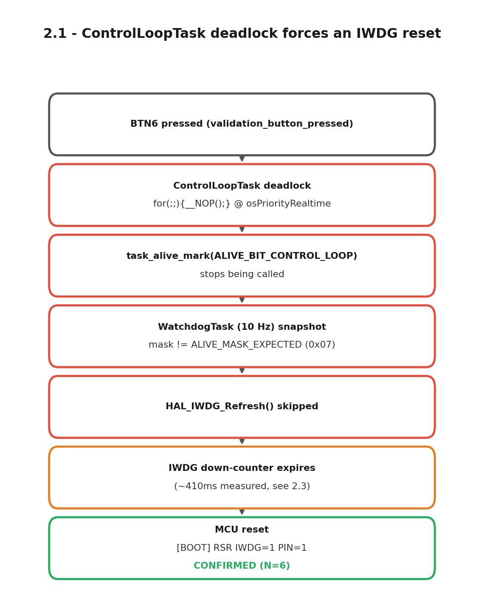

# 2.1 — ControlLoopTask deadlock forces an IWDG reset

Build flag `VALIDATION_DEADLOCK_TEST_CONTROL` puts `ControlLoopTask`
(`osPriorityRealtime`, the highest-priority task in the system) into a hard
`for(;;){ __NOP(); }` loop on a BTN6 press, stopping it from ever calling
`task_alive_mark(ALIVE_BIT_CONTROL_LOOP)` again.

## Result — N=6, all reset with IWDG=1

| Trial | Trigger (`host_t_ms`) | `[BOOT]` (`host_t_ms`) | Δt |
|---|---|---|---|
| 1 | 1465.2 | 1917.1 | 451.9ms |
| 2 | 5606.2 | 6070.8 | 464.6ms |
| 3 | 10421.9 | 10916.1 | 494.2ms |
| 4 | 15419.2 | 15860.7 | 441.5ms |
| 5 | 18320.3 | 18828.9 | 508.6ms |
| 6 | 21851.0 | 22289.4 | 438.4ms |

Mean 466.5ms, range 438.4–508.6ms. Every trial's `[BOOT]` line reads
`RSR=0x04420000` → `IWDG=1`. The spread (vs. the tighter ~410.3ms in 2.3) is
expected: `WatchdogTask` only notices the missing alive bit on its next 10Hz
snapshot, adding up to ~100ms of jitter on top of the ~410ms IWDG countdown —
consistent with the observed max of 508.6ms.

Raw log (verbatim, unedited): [`serial_log_20260906_202919.txt`](serial_log_20260906_202919.txt).
