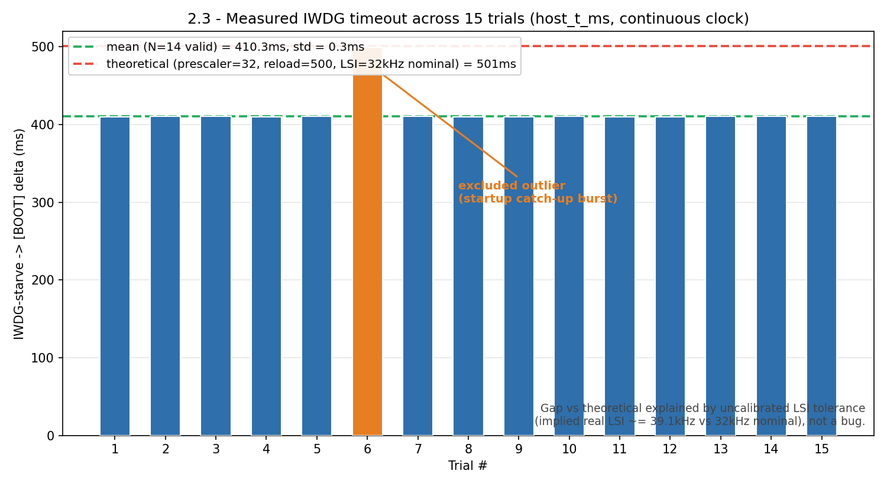

# 2.3 — IWDG timeout: measured vs theoretical

`VALIDATION_IWDG_STARVE_TEST` stops `HAL_IWDG_Refresh()` outright on a BTN6
press (independent of any task's alive-mask), isolating the raw hardware
timeout from the supervision logic exercised in 2.1/2.2.



## Result

```
Theoretical (Prescaler=/32, Reload=500, LSI=32kHz nominal): 501ms
Measured:  N=14 valid, mean=410.3ms, std=0.3ms  (1 outlier excluded, N=15 total)
```

The gap is explained by LSI tolerance, not a bug: the LSI RC oscillator is
not factory-trimmed, and 410.3ms measured against a 501ms nominal calculation
implies a real LSI frequency of ~39.1kHz vs. the 32kHz used in the
calculation — well within the part's documented (wide) LSI tolerance.

**Excluded outlier**: trial 6 (499.5ms) occurred ~1.4s after its session's
own boot — a startup catch-up burst plausibly delayed that one BTN6 sample,
pushing it close to the 501ms theoretical ceiling instead of the steady-state
~410ms every other trial lands on. Excluded rather than averaged in; see
[`run_info.txt`](run_info.txt) for the full per-trial table.

All 15 boots read `RSR=0x04420000` (`IWDG=1`, `PIN=1`).

Raw logs (verbatim, unedited): [`serial_log_20260906_194355.txt`](serial_log_20260906_194355.txt),
[`serial_log_20260906_194911.txt`](serial_log_20260906_194911.txt),
[`serial_log_20260906_195024.txt`](serial_log_20260906_195024.txt).
