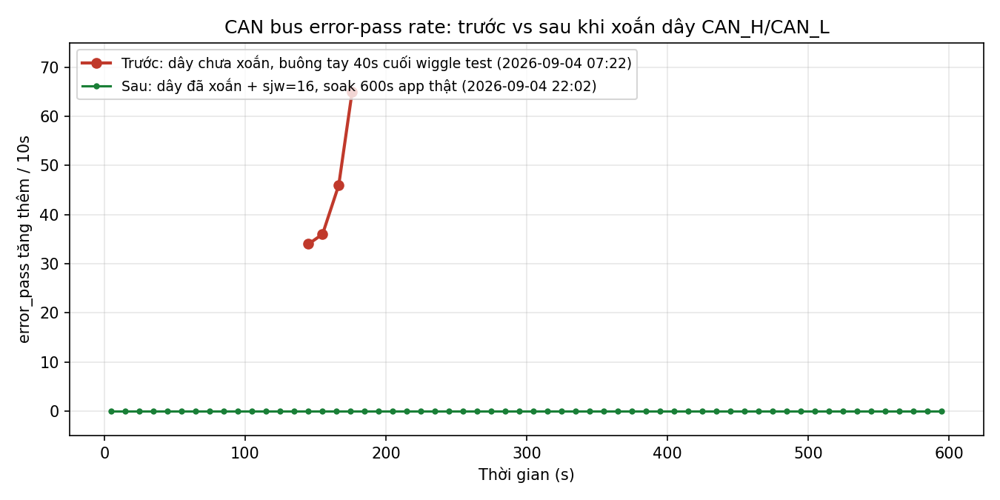

# CAN bus STM32H723 <-> Jetson: mất kết nối định kỳ (fault-flap) — đã sửa

Bus CAN 125kbps giữa STM32H723 (điều khiển) và Jetson (vision/control) mất đồng bộ định
kỳ, `stm32_ok` dao động liên tục 1↔0. Nguyên nhân gốc **đã cô lập**: cặp dây
CAN_H/CAN_L không xoắn gây nhiễu chéo — xoắn dây lại là thay đổi duy nhất xoá sạch lỗi;
`sjw=16` được giữ lại làm biên độ an toàn bổ sung nhưng đóng góp riêng của nó **chưa
được kiểm chứng độc lập**.

## Chuỗi loại trừ (đúng thứ tự đã kiểm chứng)

| Giả thuyết | Kết quả | Bằng chứng |
|---|---|---|
| Tiếp xúc vật lý chập chờn (đầu nối/mối hàn lỏng) | **[LOẠI]** | Wiggle test: tốc độ lỗi không tương quan với thao tác chạm tay, còn tăng tốc trong 40s buông tay hoàn toàn (34→36→46→65 lỗi/10s) — đúng phép đối chứng bài test tự đặt ra để loại trừ giả thuyết này |
| Lệch bitrate 2 node | **[LOẠI]** | Đọc trực tiếp `FDCAN1->NBTP` qua SWD (hotplug, không reset): STM32 thật chạy 125000 bps, sample-point 0.875 — khớp tuyệt đối với Jetson |
| `AutoRetransmission` | **[LOẠI, vốn đã đúng]** | SWD đọc `FDCAN1->CCCR.DAR=1` → đã DISABLE trên chip thật |
| `sjw` mặc định → `sjw=16` | **Thử nhưng KHÔNG đủ một mình** | Với dây CAN_H/CAN_L chưa xoắn, `sjw=16` vẫn không hết lỗi (STM32 vẫn lặp lại chu kỳ error-passive/gần-bus-off qua SWD, không phụ thuộc app có chạy hay không) |
| **Dây CAN_H/CAN_L không xoắn → nhiễu chéo/EMI** | **[NGUYÊN NHÂN CHÍNH — CÔ LẬP]** | Cách ly hai biến độc lập, `sjw=16` giữ cố định ở cả hai lần thử: dây chưa xoắn → vẫn lỗi; dây đã xoắn → 0 lỗi, soak 600s app thật, xác nhận cả hai phía (xem bảng dưới). Xoắn dây là thay đổi tạo ra khác biệt |

**Vì sao wiggle test không mâu thuẫn với kết luận cuối**: wiggle test bác bỏ đúng một
loại lỗi vật lý cụ thể — **tiếp xúc lỏng** (chạm/lắc dây không làm lỗi tăng đột biến rồi
hết khi buông tay). Dây không xoắn là một loại lỗi vật lý **khác** — nhiễu chéo/EMI thụ
động giữa hai dây chạy song song không xoắn, không đổi khi chạm vào dây, nên nằm ngoài
khả năng phát hiện của một bài test được thiết kế để tìm tiếp xúc lỏng. Hai kết luận
không mâu thuẫn nhau, chỉ là hai loại lỗi khác nhau.

**`sjw=16`**: vẫn giữ trong `scripts/can_up.sh` và `scripts/can0.service` làm biên độ an
toàn bổ sung (không hại gì — vẫn `<= phase-seg2=25`, không ảnh hưởng sample-point). Đóng
góp riêng của nó (có cần thiết cùng với dây xoắn hay chỉ là dư thừa) **chưa được cô lập
độc lập** — xem mục "Việc chưa làm" bên dưới.

## Quy tắc vận hành bắt buộc

> **Không bao giờ để `can0` up mà không có tiến trình nào đang đọc socket** (app thật,
> hoặc tối thiểu `candump`).

STM32 có thể rơi vào chu kỳ bus-off lặp lại do `AckError` khi không có ai lắng nghe phía
Jetson — hiện tượng này **vô hình với bộ đếm lỗi phía Jetson** (netlink `berr-counter`
không tăng vì Jetson không hề cố gắng nhận/gửi gì). Đây là **quy tắc phòng ngừa vận
hành, không phải một bug đã vá** — nhấn mạnh rõ để không ai đọc nhầm thành fix kỹ thuật.

## Xác minh cuối: dây xoắn + sjw=16, soak 600s

Đo 2026-09-04 22:02:39 → 22:12:39 (+07), `scripts/run_soak.sh 600
validation/03-can/twisted-pair-sjw16-verified`, app thật (`balance_ball_main`) chạy suốt,
dây CAN_H/CAN_L giữ nguyên trạng thái đã xoắn, `can0` giữ nguyên `sjw 16` (không đổi gì
trong lần đo này). Đo đồng thời cả hai phía — bài học từ điều tra trước: lỗi TX phía
Jetson từng không tương ứng 1-1 với phía STM32, và bus-off của STM32 từng vô hình với
Jetson, nên không được chỉ dựa vào một phía.

| Nguồn | Chỉ số | Kết quả |
|---|---|---|
| `app.log` (Jetson, 3028 dòng) | `FAULT` | 0 |
| `app.log` | `stm32_ok=0` | 0 |
| `app.log` | `[CAN_ERR]` | 0 |
| `candump.log` (169640 frame, 600s) | frame lỗi (ID dạng error-flag) | 0 — chỉ 6 ID hợp lệ (0x100-0x104, 0x1FF) |
| `candump.log` | gap >100ms | 0 |
| `canstats.log` (121 mẫu × 5s) | `can state` khác `ERROR-ACTIVE` | 0/121 |
| `canstats.log` | `berr-counter` khác 0 | 0/121 |
| `canstats.log` | `re-started/bus-errors/arbit-lost/error-warn/error-pass/bus-off` | 0, không đổi suốt 121 mẫu |
| `canstats.log` | RX/TX `errors`/`dropped` (netdevice) | 0/0 |
| `stm32_uart.log` | `drop`/`busoff` (cumulative) | đứng yên `4417`/`711` suốt 600s → delta=0 |
| `stm32_uart.log` | `[BOOT]` (MCU reboot) | 0 |
| **SWD** `FDCAN1->ECR`/`PSR` (`stm32_swd_poll.csv`, 1180 mẫu × 500ms ≈ 590s, không reset) | TEC/REC | 0/0 suốt |
| SWD | EP/EW/BO (`PSR.EP/EW/BO`) | 0/0/0 suốt |
| SWD | `PSR.LEC` | chỉ `NoError`/`NoChange` — không một lần `StuffError/FormError/AckError/Bit1Error/Bit0Error/CRCError` |

Sạch tuyệt đối cả hai phía đồng thời, đo độc lập bằng 3 phương pháp khác nhau (netlink
Jetson, UART self-report STM32, SWD đọc thanh ghi trực tiếp STM32) — không phụ thuộc vào
một nguồn số liệu duy nhất.

Baseline "trước" lấy từ 40s cuối wiggle test (dây chưa xoắn, buông tay hoàn toàn, xem
mục "Việc chưa làm" — file gốc không còn giữ trong repo, số liệu trích dẫn nguyên văn:
34/36/46/65 lỗi/10s, tăng tốc dần). "Sau" là toàn bộ 600s vừa đo, phẳng 0 tuyệt đối.

## Việc chưa làm

- **Đóng góp riêng của `sjw=16` chưa được cô lập độc lập.** Chưa chạy thử dây đã xoắn +
  sjw mặc định (bỏ tham số `sjw` khỏi `ip link`, để driver tự chọn) để xem lỗi có quay
  lại hay không. Đang giữ `sjw=16` như biên độ an toàn phòng ngừa, không phải một fix đã
  xác nhận cần thiết.
- Chưa có bằng chứng vận hành liên tục nhiều giờ/qua nhiều chu kỳ tắt/mở máy — 600s là
  bằng chứng dài hơn ~15 lần cửa sổ tăng tốc lỗi gốc (40s), nhưng chưa phải test dài hạn.
- Nguyên nhân STM32 tự reboot một lần (t+374s, lần soak 900s rất sớm trong điều tra) vẫn
  chưa xác định — không tái diễn ở bất kỳ lần đo nào sau đó.
